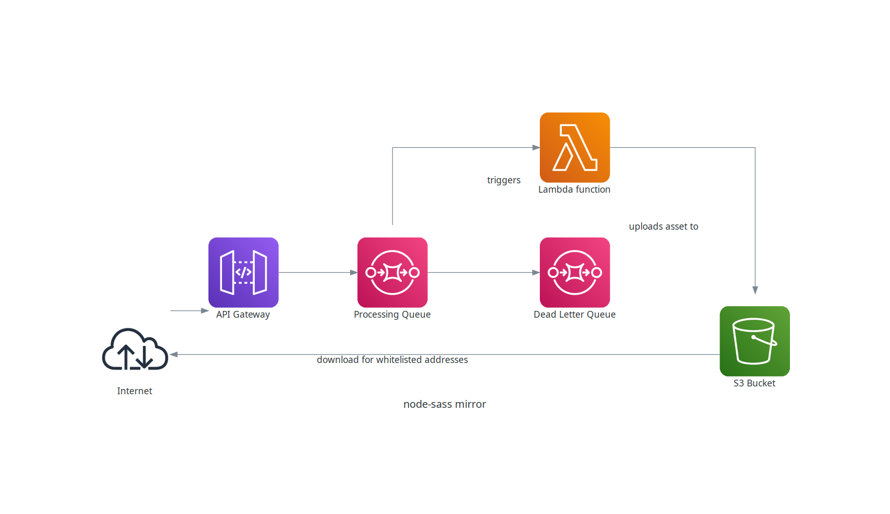

# S3 node-sass mirror

This stack can be used to setup a very basic mirror for node-sass releases.
The internal structure of the stack  is shown below



- The S3 bucket contains the assets and the required folder structure is mimicked by the creation of corresponding keys. Access to the bucket content is granted via whitelisting CIDR blocks.
- To decouple client requests and their processing a queue is introduced. This approach provides also an easy way to scale horizontally
- The Lambda function is doing the hard work: it downloads the assets from Github and uploads it to the bucket.

## Installing/ Uninstalling the application

- Install the Python libraries for the Lambda layer

```sh
cd layer
./install.sh
```

- Install all dependencies required to build the application

```sh
npm install
cdk deploy --profile <AWS profile name>
```

- If no longer required, uninstall the application.

```sh
npm install
cdk destroy --profile <AWS profile name>
```


## Useful information

- Before deploying the stack revisit the whitelisting section. Only to those addresses the mirrored files will be available for download.

```sh
new NodeSassMirrorStack(app, 'my-stack-dev', {
  env: devEnv,
  whitelist: ['87.123.53.81/32'],
});
```

- Clients connecting to the API Gateway need to use an API key. This key can be fetched using

```sh
aws apigateway get-api-keys --name-query <api-key-name> --include-value --profile <AWS profile name>
```

Use the content of the field `value`.

## Example

Using the API gateway to trigger mirroring of version 4.13.1 of the node-sass release

```sh
curl -X POST  -H "x-api-key: <api-key-value>" https://<api-gw-id>.execute-api.eu-central-1.amazonaws.com/prod/v1.0/mirror?tag=v4.13.1
```

## ToDos

- Example for S3 bucket keys (folder structure)
- Output S3 bucket, output API Key name
- Return proper return values from Lambda
- Add detection for messages in dead letter queue

## Links

- [AWS S3](https://aws.amazon.com/s3/)
- [AWS SQS Metadata](https://docs.aws.amazon.com/AWSSimpleQueueService/latest/SQSDeveloperGuide/sqs-message-metadata.html)
- [GitHub REST Release API](https://docs.github.com/en/free-pro-team@latest/rest)
- [Node Sass Releases](https://api.github.com/repos/sass/node-sass/releases)
